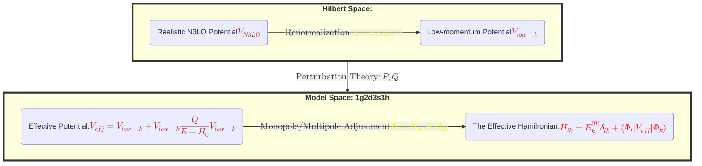

<h2>Effective Interaction <em>(1g2d3s1h):</em></h2>

```mermaid
%%{ init: { 'flowchart': { 'curve': '' } } }%%
flowchart TD
    A("Realistic N3LO Potential $$\color{Brown}V_{N3LO}$$")
    B("Low-momentum Potential $$\color{Brown} V_{low-k}$$")
    C("Effective Potential: $$\color{Brown}V_{eff}=V_{low-k}+V_{low-k}\frac{Q}{E-H_0}V_{low-k}$$")
    D("The Effective Hamilronian: $$\color{Red} H_{lk} = E_{k}^{(0)}\delta_{l k}+\langle\Phi_{l}|V_{eff}|\Phi_{k}\rangle$$")
    
    style space1 fill:#0,stroke:#333,stroke-width:4px
    style space2 fill:#0,stroke:#333,stroke-width:4px


    subgraph space1["`**Hilbert Space:**`"]
    A -->|"$$\textup{Renormalization:}$$
    $$\color{Yellow} \Lambda = 2.2 fm^{-1}$$"| B
    end
    
    subgraph space2["`**Model Space: 1g2d3s1h**`"]
	C -->|"$$\textup{Monopole/Multipole Adjustment}$$
    $$\color{Yellow}H = H_m +  H_M$$"| D
    end

    space1 -->|"$$\textup{Perturbation Theory}: P, Q$$"| space2
    
```

